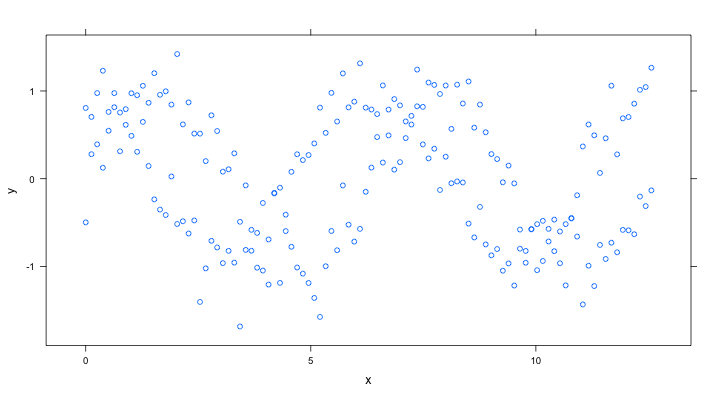
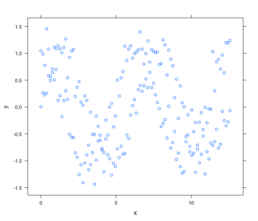
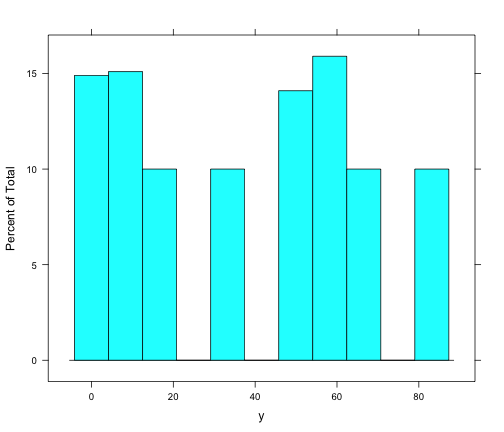
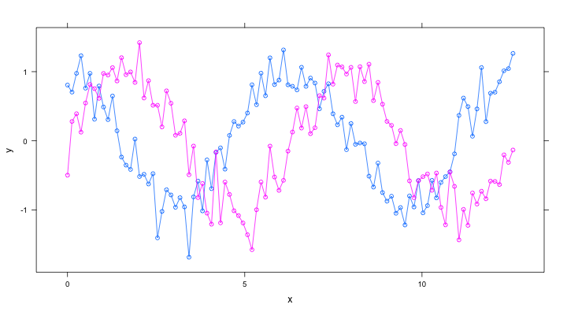
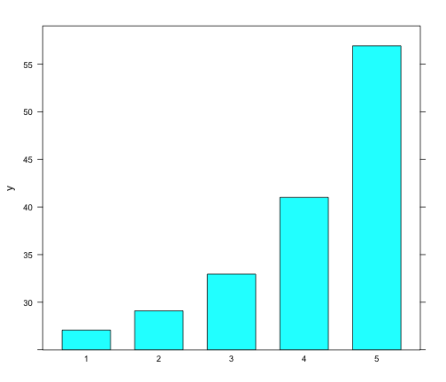
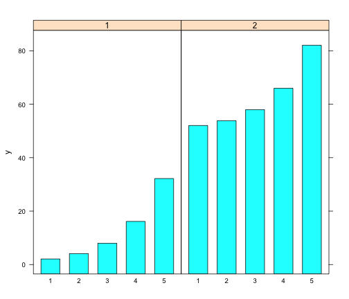
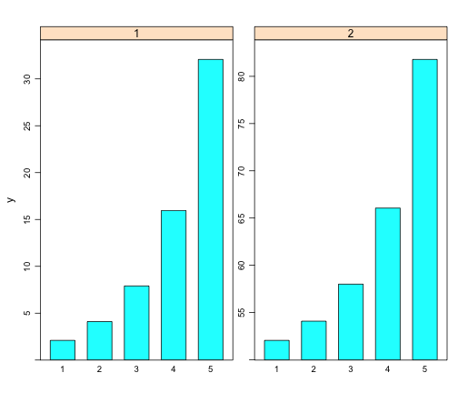
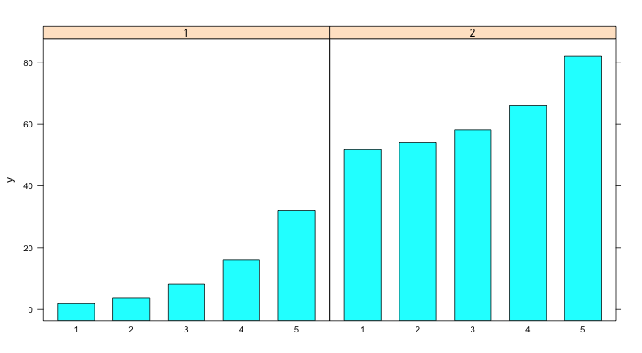

## Graphics Frameworks

### graphics
- Part of R "base", nothing extra to install

### lattice
- An implementation of Trellis graphics for R
- Trellis graphics are a relatively new style of graphics that are particularly useful for displaying multivariate and especially grouped data

### ggplot2
- Based on the grammar of graphics, which tries to take the good parts of base and lattice graphics and none of the bad parts


--- &vcenter

## Base graphics


### DONT WASTE YOUR TIME

---

## Test Data 1 - Long Format


```r
x <- seq(0, 4 * pi, length.out = 100)
y <- c(sin(x), cos(x)) + rnorm(200, sd = 0.25)
d1 <- data.frame(y = y, x = rep(x, 2), type = rep(c("sin", "cos"), each = length(x)))
str(d1)
```

```
## 'data.frame':	200 obs. of  3 variables:
##  $ y   : num  -0.497 0.279 0.392 0.125 0.547 ...
##  $ x   : num  0 0.127 0.254 0.381 0.508 ...
##  $ type: Factor w/ 2 levels "cos","sin": 2 2 2 2 2 2 2 2 2 2 ...
```


---

## Test Data 2 - Wide Format


```r
d2 <- data.frame(reshape(d1, timevar = "type", idvar = c("x"), direction = "wide"))
str(d2)
```

```
## 'data.frame':	100 obs. of  3 variables:
##  $ x    : num  0 0.127 0.254 0.381 0.508 ...
##  $ y.sin: num  -0.497 0.279 0.392 0.125 0.547 ...
##  $ y.cos: num  0.807 0.704 0.976 1.231 0.761 ...
```


---

## Test Data 3


```r
d3 <- data.frame(x=rep(1:5,each=100),
                 y=c(unlist(lapply(1:5, function(x){rnorm(n=100,mean=2^x)})),
                     unlist(lapply(1:5, function(x){rnorm(n=100,mean=50+2^x)}))),
                 g=rep(1:2,each=500))
```


--- &twocol

## Lattice


```r
install.packages("lattice", dependencies = TRUE)
```


*** left

**Univariate**:
- <span style="color:blue;">barchart</span>: Bar plots
- <span style="color:blue;">bwplot</span>: Box-and-whisker plots
- <span style="color:blue;">densityplot</span>: Kernel density estimates
- <span style="color:blue;">dotplot</span>: Cleveland dot plots
- <span style="color:blue;">histogram</span>: Histograms
- <span style="color:blue;">qqmath</span>: Theretical quantile plots
- <span style="color:blue;">stripplot</span>: One-dimensional scatterplots

*** right

**Bivariate**:
- <span style="color:blue;">qq</span>: Quantile plots
- <span style="color:blue;">xyplot</span>: Scatterplots and time-series plots

**Trivariate**:
- <span style="color:blue;">levelplot</span>: Level plots
- <span style="color:blue;">contourplot</span>: Contour plots
- <span style="color:blue;">cloud</span>: Three-dimensional scatter plots
- <span style="color:blue;">wireframe</span>: Three-dimensional surface plots

---

## Lattice - xyplot


```r
xyplot(y ~ x, d1)  # long data
```

 


---

## Lattice - xyplot w/ conditioning factor


```r
xyplot(y ~ x | type, d1)  # long data
```

 


---

## Lattice - xyplot w/ grouping factor


```r
xyplot(y ~ x, d1, groups = type)  # long data
```

 


---

## Lattice - xyplot w/ two y variables


```r
xyplot(y.cos + y.sin ~ x, d2)  # wide data
```

 


---

## Lattice - xyplot w/ type="l"


```r
xyplot(y ~ x, d1, groups = type, type = "l")  # long data
```

 


---

## Lattice - xyplot w/ type="b"


```r
xyplot(y ~ x, d1, groups = type, type = "b")  # long data
```

 


--- &twocol

## Lattice Panels

*** left


```r
xyplot(y ~ x, d1, groups = type, type="b",
       panel=function(...) {
         panel.xyplot(...)
         }
       )
```


*** right

 


--- &twocol

## Lattice Panels + Smoother

*** left


```r
xyplot(y ~ x, d1, groups = type, type="p",
  panel=panel.superpose,
  panel.groups=function(...,pch,lwd) {
    panel.xyplot(...,pch=2)
    panel.loess(..., span=.2, lwd=4)
  }
)
```


*** right

 


---

## Lattice - histogram


```r
histogram(~y, d3)
```

 


---

## Lattice - histogram w/ conditioning factor


```r
histogram(~y | as.factor(g), d3)
```

 


---

## Lattice - barchart


```r
barchart(y ~ as.factor(x), aggregate(y ~ x, data = d3, mean))
```

 


---

## Lattice - barchart w/ conditioning factor


```r
barchart(y ~ as.factor(x) | as.factor(g), aggregate(y ~ x + g, data = d3, mean))
```

 


---

## Lattice - barchart w/ grouping factor


```r
barchart(y ~ as.factor(x), aggregate(y ~ x + g, data = d3, mean), groups = as.factor(g))
```

 


--- &twocol

## Lattice - barchart w/ auto.key

*** left


```r
barchart(y~as.factor(x),
         aggregate(y~x+g,data=d3,mean),
         groups=as.factor(g),
         auto.key=T)
```


*** right

 


--- &twocol

## Lattice - barchart w/ auto.key

*** left


```r
barchart(y~as.factor(x),
         aggregate(y~x+g,data=d3,mean),
         groups=as.factor(g),
         auto.key=list(columns=2))
```


*** right

 


--- &twocol

## Lattice - barchart w/ auto.key

*** left


```r
barchart(y~as.factor(x),
         aggregate(y~x+g,data=d3,mean),
         groups=as.factor(g),
         auto.key=list(space="right"))
```


*** right

 

