## Graphics Frameworks

### graphics
- Part of R "base", nothing extra to install

### lattice
- An implementation of Trellis graphics for R
- Trellis graphics are a relatively new style of graphics that are particularly useful for displaying multivariate and especially grouped data

### ggplot2
- Based on the grammar of graphics, which tries to take the good parts of base and lattice graphics and none of the bad parts


--- &vcenter

## Base graphics


### DONT WASTE YOUR TIME

--- &vcenter

## Test Data


```r
source("https://raw.github.com/RyanHope/plotting-in-r/gh-pages/data.R")
```

--- &twocol

## Test Data 1 - Wide Format

wide = efficient storage but hard to work with

*** =left


```r
x <- seq(-pi,pi,length.out=100)
y.sin <- sin(x) + rnorm(100,sd=.25)
y.cos <- cos(x) + rnorm(100,sd=.25)
d1 <- data.frame(
  x=x,
  y.sin=y.sin,
  y.cos=y.cos
)
```

*** =right


```r
head(d1)
```

```
##           x       y.sin      y.cos
## 1 -3.141593 -0.06350776 -1.2853265
## 2 -3.078126 -0.32124640 -1.2566857
## 3 -3.014660  0.04408846 -1.2284733
## 4 -2.951193 -0.52043548 -1.2873943
## 5 -2.887727 -0.40772922 -0.6982391
## 6 -2.824260 -0.24090673 -1.1172758
```

--- &twocol

## Test Data 2 - Long Format

long = inefficient storage but easy to work with


```r
install.packages('reshape2', dependencies = TRUE)
```

*** =left


```r
d2 <- melt(
  d1,
  id.vars=c("x"), 
  variable.name="type", 
  value.name="y"
)
```

*** =right


```r
head(d2)
```

```
##           x  type           y
## 1 -3.141593 y.sin -0.06350776
## 2 -3.078126 y.sin -0.32124640
## 3 -3.014660 y.sin  0.04408846
## 4 -2.951193 y.sin -0.52043548
## 5 -2.887727 y.sin -0.40772922
## 6 -2.824260 y.sin -0.24090673
```

---

## Test Data 3


```r
d3 <- data.frame(
  x=rep(1:5,each=100),
  y=c(unlist(lapply(1:5, function(x){rnorm(n=100,mean=2^x)})),
      unlist(lapply(1:5, function(x){rnorm(n=100,mean=50+2^x)}))),
  g=rep(1:2,each=500))
head(d3)
```

```
##   x        y g
## 1 1 2.715525 1
## 2 1 2.047138 1
## 3 1 1.527172 1
## 4 1 2.242786 1
## 5 1 2.301681 1
## 6 1 3.932747 1
```

--- &twocol

## Lattice


```r
install.packages('lattice', dependencies = TRUE)
```


*** =left

**Univariate**:
- <span style="color:blue;">barchart</span>: Bar plots
- <span style="color:blue;">bwplot</span>: Box-and-whisker plots
- <span style="color:blue;">densityplot</span>: Kernel density estimates
- <span style="color:blue;">dotplot</span>: Cleveland dot plots
- <span style="color:blue;">histogram</span>: Histograms
- <span style="color:blue;">qqmath</span>: Theretical quantile plots
- <span style="color:blue;">stripplot</span>: One-dimensional scatterplots

*** =right

**Bivariate**:
- <span style="color:blue;">qq</span>: Quantile plots
- <span style="color:blue;">xyplot</span>: Scatterplots and time-series plots

**Trivariate**:
- <span style="color:blue;">levelplot</span>: Level plots
- <span style="color:blue;">contourplot</span>: Contour plots
- <span style="color:blue;">cloud</span>: Three-dimensional scatter plots
- <span style="color:blue;">wireframe</span>: Three-dimensional surface plots

--- &twocol

## Lattice - histogram

*** =left

$$
x(1:5)|100 \\
y(g=1)=x^2 \\
y(g=2)=50+x^2
$$


```r
histogram(~y,d3)
```

*** =right

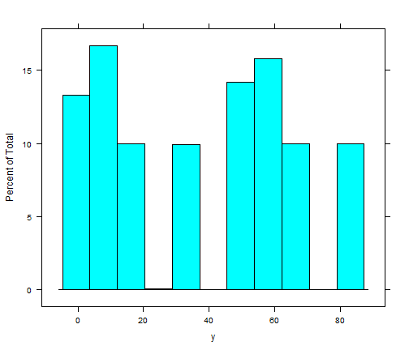 

--- &twocol

## Lattice - histogram w/ conditioning factor

*** =left

$$
x(1:5)|100 \\
y(g=1)=x^2 \\
y(g=2)=50+x^2
$$


```r
histogram(~y|as.factor(g),d3)
```

*** =right

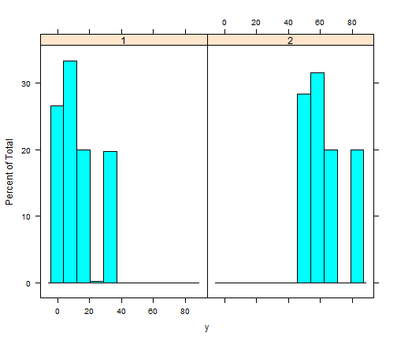 

--- &twocol

## Lattice - barchart

*** =left

$$
x(1:5)|100 \\
y(g=1)=x^2 \\
y(g=2)=50+x^2
$$


```r
barchart(y ~ as.factor(x),
  aggregate(y ~ x, data = d3, mean))
```

*** =right

 

--- &twocol

## Lattice - barchart w/ conditioning factor

*** =left

$$
x(1:5)|100 \\
y(g=1)=x^2 \\
y(g=2)=50+x^2
$$


```r
barchart(y ~ as.factor(x) | as.factor(g),
  aggregate(y ~ x + g, data = d3, mean))
```

*** =right

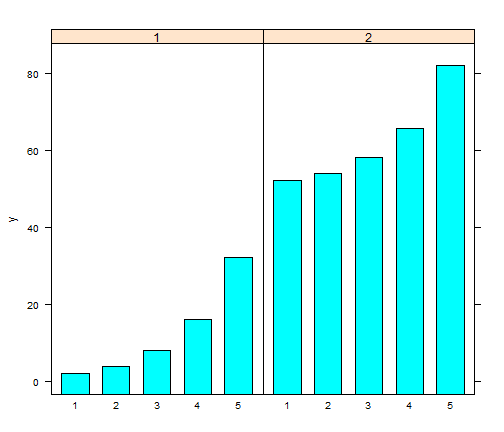 

--- &twocol

## Lattice - condition barchart w/ free scales

*** =left

$$
x(1:5)|100 \\
y(g=1)=x^2 \\
y(g=2)=50+x^2
$$


```r
barchart(y ~ as.factor(x) | as.factor(g),
  aggregate(y ~ x + g, data = d3, mean),
  scales=list(y=list(relation="free")))
```

*** =right

 

--- &twocol

## Lattice - barchart w/ grouping factor

*** =left

$$
x(1:5)|100 \\
y(g=1)=x^2 \\
y(g=2)=50+x^2
$$


```r
barchart(y ~ as.factor(x),
  aggregate(y ~ x + g, data = d3, mean),
  groups = as.factor(g))
```

*** =right

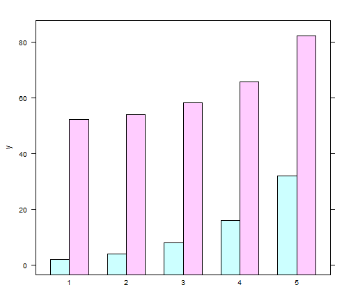 

--- &twocol

## Lattice - barchart w/ auto.key

*** =left

$$
x(1:5)|100 \\
y(g=1)=x^2 \\
y(g=2)=50+x^2
$$


```r
barchart(y ~ as.factor(x),
  aggregate(y ~ x + g, data = d3, mean),
  groups = as.factor(g),
  auto.key = T)
```

*** =right

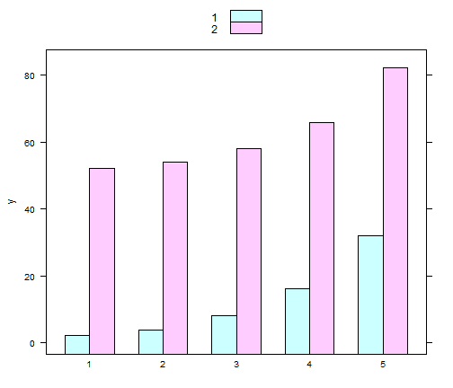 

--- &twocol

## Lattice - barchart w/ auto.key

*** =left

$$
x(1:5)|100 \\
y(g=1)=x^2 \\
y(g=2)=50+x^2
$$


```r
barchart(y ~ as.factor(x),
  aggregate(y ~ x + g, data = d3, mean),
  groups = as.factor(g),
  auto.key = list(columns = 2))
```

*** =right

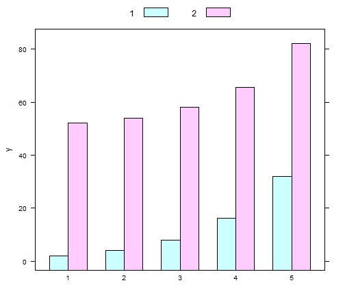 

--- &twocol

## Lattice - barchart w/ auto.key

*** =left

$$
x(1:5)|100 \\
y(g=1)=x^2 \\
y(g=2)=50+x^2
$$


```r
barchart(y ~ as.factor(x),
  aggregate(y ~ x + g, data = d3, mean),
  groups = as.factor(g),
  auto.key = list(space = "right"))
```

*** =right

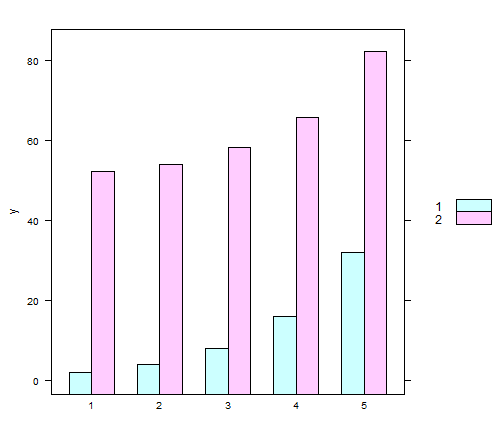 

--- &twocol

## Lattice - xyplot

*** =left

$$
x(-pi:pi)|100 \\
y(type=sin)=sin(x)+\epsilon \\
y(type=cos)=cos(x)+\epsilon
$$


```r
xyplot(y~x,d2)
```

*** =right

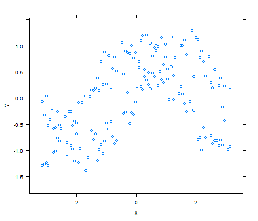 

--- &twocol

## Lattice - xyplot w/ conditioning factor

REQUIRES LONG FORMAT

*** =left

$$
x(-pi:pi)|100 \\
y(type=sin)=sin(x)+\epsilon \\
y(type=cos)=cos(x)+\epsilon
$$


```r
xyplot(y~x|type,d2)
```

*** =right

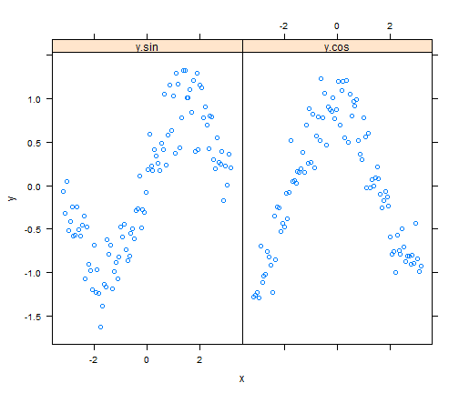 

--- &twocol

## Lattice - xyplot w/ grouping factor

REQUIRES LONG FORMAT

*** =left

$$
x(-pi:pi)|100 \\
y(type=sin)=sin(x)+\epsilon \\
y(type=cos)=cos(x)+\epsilon
$$


```r
xyplot(y ~ x, d2, groups = type,
  auto.key = list(space = "right"))
```

*** =right

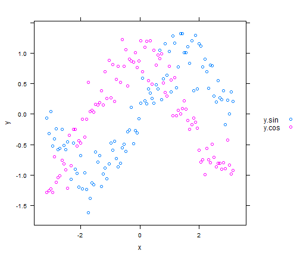 

--- &twocol

## Lattice - xyplot w/ two y variables

REQUIRES WIDE FORMAT

*** =left

$$
x(-pi:pi)|100 \\
y(type=sin)=sin(x)+\epsilon \\
y(type=cos)=cos(x)+\epsilon
$$


```r
xyplot(y.cos + y.sin ~ x, d1,
  auto.key = list(space = "right"))
```

*** =right

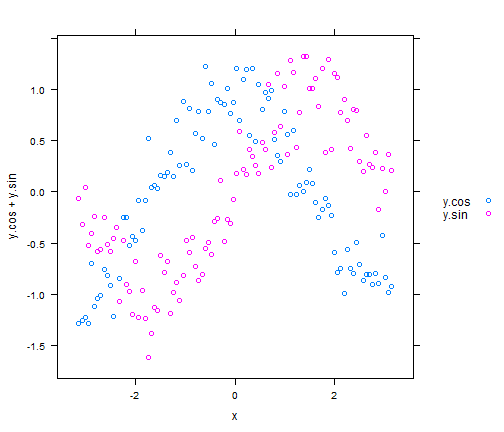 

--- &twocol

## Lattice - xyplot - changing plot type

*** =left


```r
xyplot(y ~ x, d2, groups = type,
  auto.key = list(space = "right"),
  type = "l")
```

*** =right

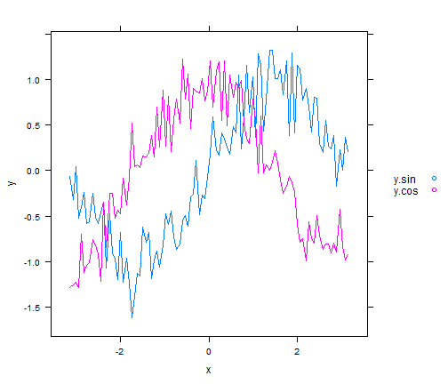 

--- &twocol

## Lattice - xyplot - changing plot type

*** =left


```r
xyplot(y ~ x, d2, groups = type,
  auto.key = list(space = "right"),
  type = "b")
```

*** =right

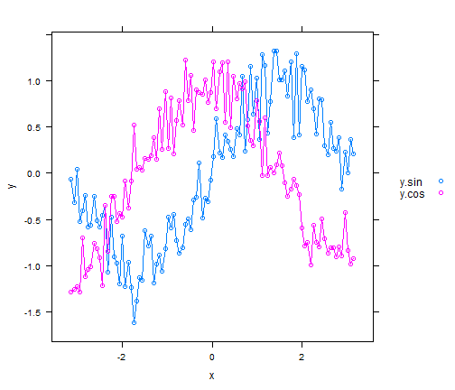 

--- &twocol

## Lattice - xyplot - opther options

*** =left


```r
xyplot(y ~ x, d2, groups = type,
  auto.key = list(space = "right"),
  type = "b", pch=2, cex=.5, lty=2, lwd=2)
```

*** =right

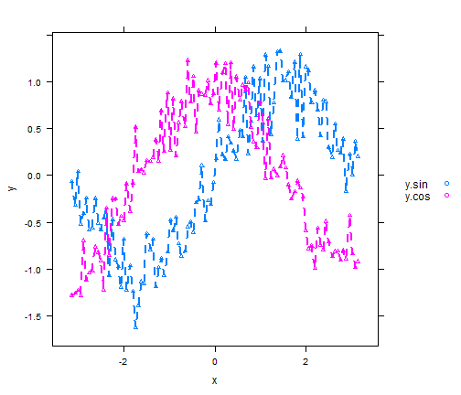 

--- &twocol

## Lattice - xyplot - tick locations

*** =left


```r
xyplot(y ~ x, d2, groups = type,
  auto.key = list(space = "right"),
  scales = list(x = list(
    at = c(-pi, -pi/2, 0, pi/2, pi))))
```

*** =right

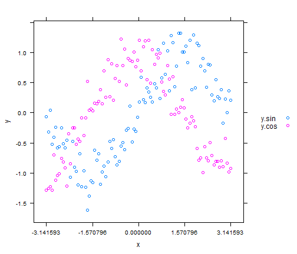 

--- &twocol

## Lattice - xyplot - tick labels

*** =left


```r
l <- expression(-pi, -pi/2, 0, pi/2, pi)
xyplot(y ~ x, d2, groups = type,
  auto.key = list(space = "right"),
  scales = list(x = list(
    at = c(-pi, -pi/2, 0, pi/2, pi),
    labels = l
    )))
```

*** =right

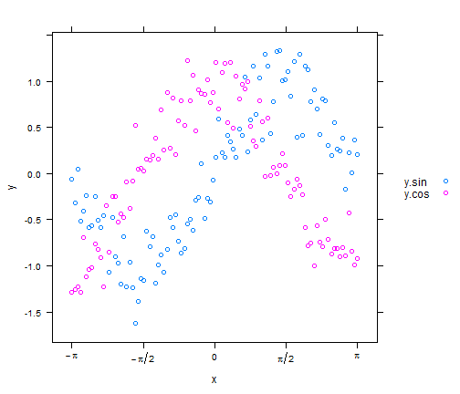 

--- &twocol

## Lattice Panels

*** =left


```r
xyplot(y ~ x, d2, groups = type,
  auto.key = list(space = "right"),
  type = "b",
  panel=function(...) {
    panel.xyplot(...)
  }
)
```

*** =right

 

--- &twocol

## Lattice Panels + Smoother

*** =left


```r
xyplot(y ~ x, d2, groups = type,
  auto.key = list(space = "right"),
  type = "p",
  panel = panel.superpose,
  panel.groups = function(..., pch, lwd) {
    panel.xyplot(..., pch = 2)
    panel.loess(..., span = .2, lwd = 4)
  }
)
```

*** =right

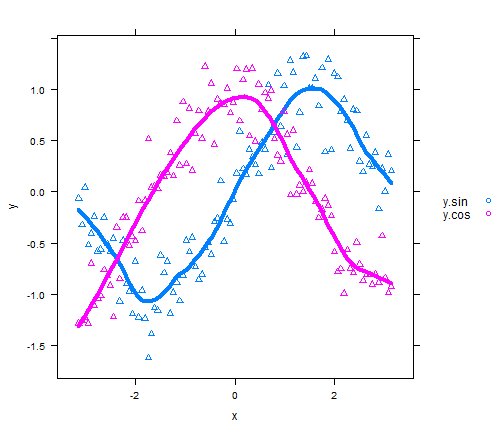 

---

## Lattice - need help?

### The arguments and valid values for all lattice plot functions are described in the help page for 'xyplot'.


```r
help(trellis)
```

---

## ggplot2

### Great documentation and examples available online

- http://docs.ggplot2.org/current
- http://www.cookbook-r.com/Graphs/


```r
install.packages('ggplot2', dependencies = TRUE)
```


---

## ggplot2 basics

- Geoms
 - short for geometric objects, describe the type of plot you will produce
- Statistics
 - transform your data before plotting
- Scales
 - control the mapping between data and aesthetics
- Coordinate systems
 - adjust the mapping from coordinates to the 2d plane of the computer screen
- Faceting
 - display subsets of the dataset in different panels

--- &twocol

## ggplot2 - histogram

*** =left

$$
x(1:5)|100 \\
y(g=1)=x^2 \\
y(g=2)=50+x^2
$$


```r
ggplot(d3) + 
  geom_histogram(aes(x=y))
```

*** =right

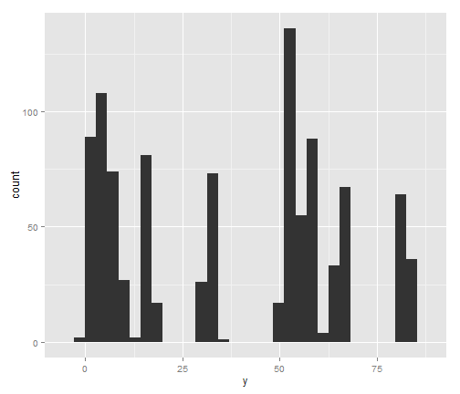 

--- &twocol

## ggplot2 - histogram w/ facets

*** =left

$$
x(1:5)|100 \\
y(g=1)=x^2 \\
y(g=2)=50+x^2
$$


```r
ggplot(d3) +
  geom_histogram(aes(x=y)) +
  facet_grid(.~g)
```

*** =right

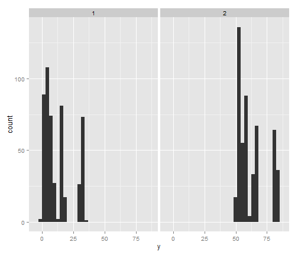 

--- &twocol

## ggplot2 - barchart

*** =left

$$
x(1:5)|100 \\
y(g=1)=x^2 \\
y(g=2)=50+x^2
$$


```r
ggplot(aggregate(y ~ x, data = d3, mean)) + 
  geom_bar(aes(x=factor(x), y=y), stat="identity")
```

*** =right

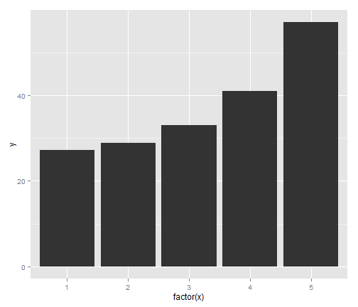 

--- &twocol

## ggplot2 - barchart w/ facets

*** =left

$$
x(1:5)|100 \\
y(g=1)=x^2 \\
y(g=2)=50+x^2
$$


```r
ggplot(aggregate(y ~ x + g, data = d3, mean)) + 
    geom_bar(aes(x=factor(x),
                 y=y),
             stat="identity") +
    facet_wrap(~g)
```

*** =right

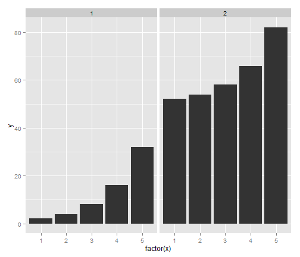 

--- &twocol

## ggplot2 - barchart w/ facets + free scales

*** =left

$$
x(1:5)|100 \\
y(g=1)=x^2 \\
y(g=2)=50+x^2
$$


```r
ggplot(aggregate(y ~ x + g, data = d3, mean)) + 
    geom_bar(aes(x=factor(x),
                 y=y),
             stat="identity") +
    facet_wrap(~g, scales="free_y")
```

*** =right

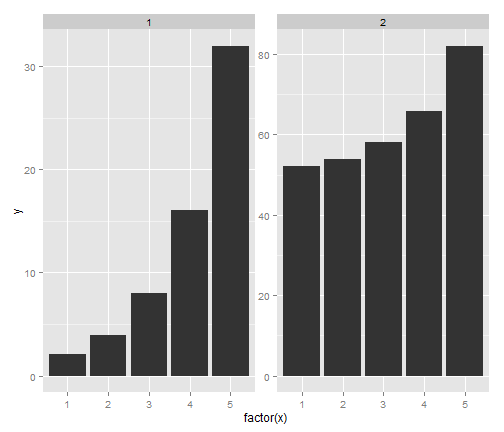 

--- &twocol

## ggplot2 - barchart w/ grouping factor stacked

*** =left

$$
x(1:5)|100 \\
y(g=1)=x^2 \\
y(g=2)=50+x^2
$$


```r
ggplot(aggregate(y ~ x + g, data = d3, mean)) + 
    geom_bar(aes(x=factor(x),
                 y=y,
                 group=factor(g),
                 fill=factor(g)),
             stat="identity")
```

*** =right

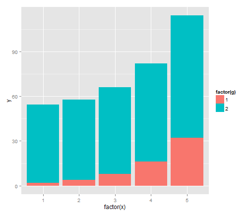 

--- &twocol

## ggplot2 - barchart w/ grouping factor dodge

*** =left

$$
x(1:5)|100 \\
y(g=1)=x^2 \\
y(g=2)=50+x^2
$$


```r
ggplot(aggregate(y ~ x + g, data = d3, mean)) + 
    geom_bar(aes(x=factor(x),
                 y=y,
                 group=factor(g),
                 fill=factor(g)),
             stat="identity",
             position="dodge")
```

*** =right

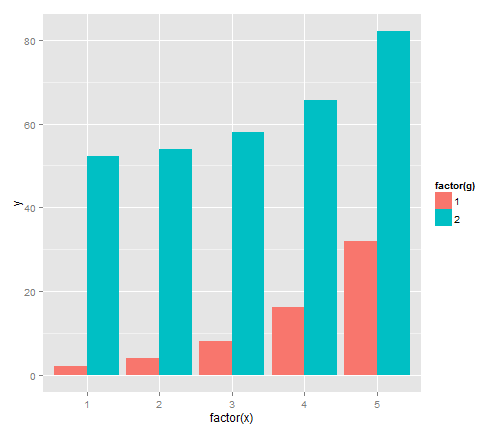 

--- &twocol

## ggplot2 - scatter plot

LONG FORMAT

*** =left

$$
x(-pi:pi)|100 \\
y(type=sin)=sin(x)+\epsilon \\
y(type=cos)=cos(x)+\epsilon
$$


```r
ggplot(d1) +
  geom_point(aes(x=x,y=y.sin),color="red") + 
  geom_point(aes(x=x,y=y.cos),color="blue")
```

*** =right

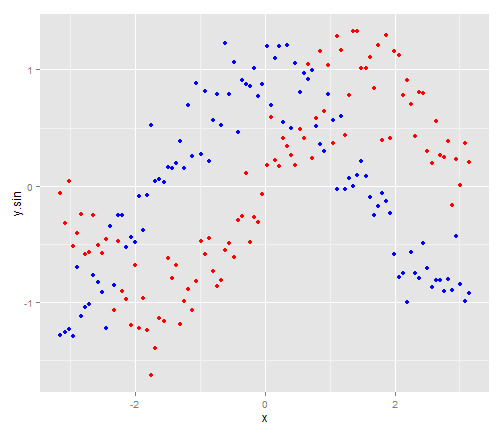 

--- &twocol

## ggplot2 - scatter plot w/ groups + smoother

LONG FORMAT

*** =left

$$
x(-pi:pi)|100 \\
y(type=sin)=sin(x)+\epsilon \\
y(type=cos)=cos(x)+\epsilon
$$


```r
ggplot(d2, aes(x=x,y=y,group=type,color=type)) + 
  geom_point() +
  geom_line() +
  stat_smooth(method="loess")
```

*** =right

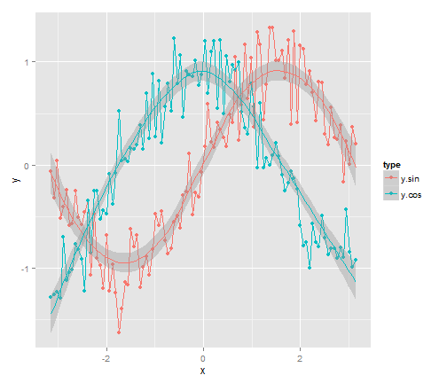 

--- &twocol

## ggplot2 - scatter plot w/ facets + smoother

LONG FORMAT

*** =left

$$
x(-pi:pi)|100 \\
y(type=sin)=sin(x)+\epsilon \\
y(type=cos)=cos(x)+\epsilon
$$


```r
ggplot(d2, aes(x=x,y=y,color=type)) + 
  geom_point() +
  geom_line() +
  facet_grid(type~.) + 
  stat_smooth(method="loess")
```

*** =right

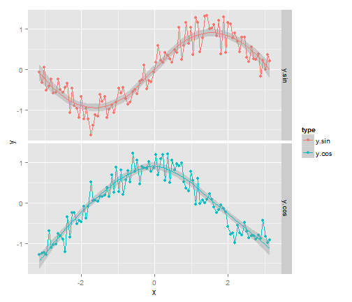 

--- &twocol

## ggplot2 - scatter plot w/ facets + smoother + scales


```r
install.packages('scales', dependencies = TRUE)
```

*** =left


$$
x(-pi:pi)|100 \\
y(type=sin)=sin(x)+\epsilon \\
y(type=cos)=cos(x)+\epsilon
$$


```r
pi_scales <- math_format(.x * pi, 
                         format=function(x) x / pi)
ggplot(d2, aes(x=x,y=y,color=type)) + 
  geom_point() +
  geom_line() +
  facet_grid(type~.) + 
  stat_smooth(method="loess") +
  scale_x_continuous(labels=pi_scales,
                     breaks=seq(-pi,pi,pi/4))
```

*** =right

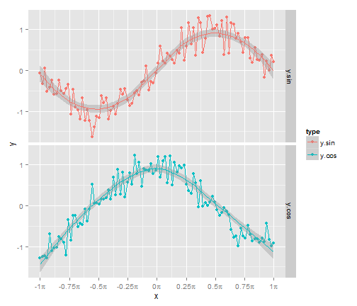 
