## Graphics Frameworks

### graphics
- Part of R "base", nothing extra to install

### lattice
- An implementation of Trellis graphics for R
- Trellis graphics are a relatively new style of graphics that are particularly useful for displaying multivariate and especially grouped data

### ggplot2
- Based on the grammar of graphics, which tries to take the good parts of base and lattice graphics and none of the bad parts


--- &vcenter

## Base graphics


### DONT WASTE YOUR TIME

--- &vcenter

## Test Data


```r
source("https://raw.github.com/RyanHope/plotting-in-r/gh-pages/data.R")
```

---

## Test Data 1 - Long Format


```r
x <- seq(-pi,pi,length.out=100)
y <- c(sin(x),cos(x)) + rnorm(200,sd=.25)
d1 <- data.frame(y=y,x=rep(x,2),type=rep(c("sin","cos"),each=length(x)))
str(d1)
```

```
## 'data.frame':	200 obs. of  3 variables:
##  $ y   : num  0.257 -0.186 -0.494 -0.438 -0.773 ...
##  $ x   : num  -3.14 -3.08 -3.01 -2.95 -2.89 ...
##  $ type: Factor w/ 2 levels "cos","sin": 2 2 2 2 2 2 2 2 2 2 ...
```

---

## Test Data 2 - Wide Format


```r
d2 <- data.frame(reshape(d1, timevar="type", idvar=c("x"), direction="wide"))
str(d2)
```

```
## 'data.frame':	100 obs. of  3 variables:
##  $ x    : num  -3.14 -3.08 -3.01 -2.95 -2.89 ...
##  $ y.sin: num  0.257 -0.186 -0.494 -0.438 -0.773 ...
##  $ y.cos: num  -0.69 -0.898 -1.232 -0.866 -0.797 ...
```

---

## Test Data 3


```r
d3 <- data.frame(
  x=rep(1:5,each=100),
  y=c(unlist(lapply(1:5, function(x){rnorm(n=100,mean=2^x)})),
      unlist(lapply(1:5, function(x){rnorm(n=100,mean=50+2^x)}))),
  g=rep(1:2,each=500))
```

---

## Test Data 4


```r
x <- seq(pi/4, 5 * pi, length.out = 100)
y <- seq(pi/4, 5 * pi, length.out = 100)
r <- as.vector(sqrt(outer(x^2, y^2, "+")))
d4 <- expand.grid(x=x, y=y)
d4$z <- cos(r^2) * exp(-r/(pi^3))
```

--- &twocol

## Lattice


```r
install.packages('lattice', dependencies = TRUE)
```


*** =left

**Univariate**:
- <span style="color:blue;">barchart</span>: Bar plots
- <span style="color:blue;">bwplot</span>: Box-and-whisker plots
- <span style="color:blue;">densityplot</span>: Kernel density estimates
- <span style="color:blue;">dotplot</span>: Cleveland dot plots
- <span style="color:blue;">histogram</span>: Histograms
- <span style="color:blue;">qqmath</span>: Theretical quantile plots
- <span style="color:blue;">stripplot</span>: One-dimensional scatterplots

*** =right

**Bivariate**:
- <span style="color:blue;">qq</span>: Quantile plots
- <span style="color:blue;">xyplot</span>: Scatterplots and time-series plots

**Trivariate**:
- <span style="color:blue;">levelplot</span>: Level plots
- <span style="color:blue;">contourplot</span>: Contour plots
- <span style="color:blue;">cloud</span>: Three-dimensional scatter plots
- <span style="color:blue;">wireframe</span>: Three-dimensional surface plots

--- &twocol

## Lattice - histogram

*** =left


```r
histogram(~y,d3)
```

*** =right

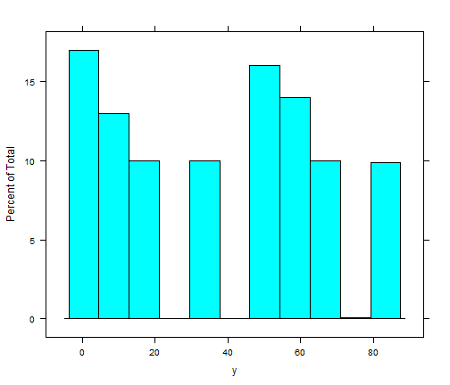 

--- &twocol

## Lattice - histogram w/ conditioning factor

*** =left


```r
histogram(~y|as.factor(g),d3)
```

*** =right

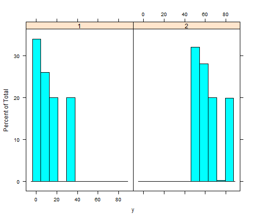 

--- &twocol

## Lattice - barchart

*** =left


```r
barchart(y ~ as.factor(x),
  aggregate(y ~ x, data = d3, mean))
```

*** =right

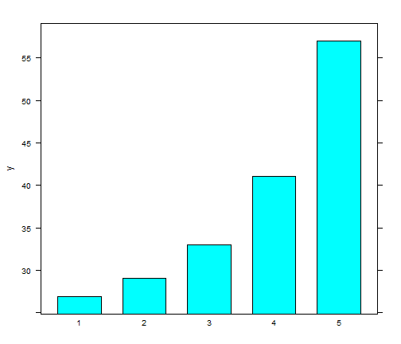 

--- &twocol

## Lattice - barchart w/ conditioning factor

*** =left


```r
barchart(y ~ as.factor(x) | as.factor(g),
  aggregate(y ~ x + g, data = d3, mean))
```

*** =right

 

--- &twocol

## Lattice - condition barchart w/ free scales

*** =left


```r
barchart(y ~ as.factor(x) | as.factor(g),
  aggregate(y ~ x + g, data = d3, mean),
  scales=list(y=list(relation="free")))
```

*** =right

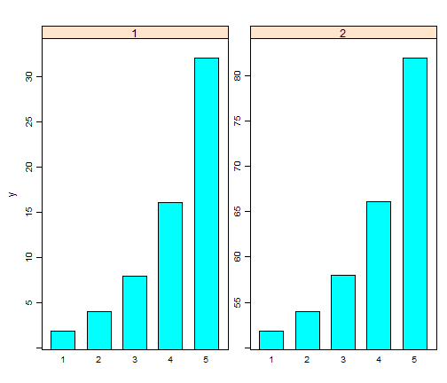 

--- &twocol

## Lattice - barchart w/ grouping factor

*** =left


```r
barchart(y ~ as.factor(x),
  aggregate(y ~ x + g, data = d3, mean),
  groups = as.factor(g))
```

*** =right

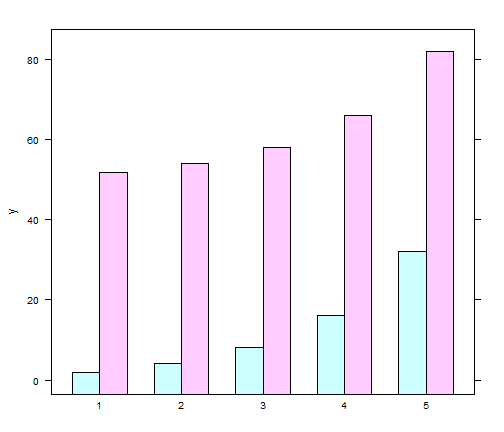 

--- &twocol

## Lattice - barchart w/ auto.key

*** =left


```r
barchart(y ~ as.factor(x),
  aggregate(y ~ x + g, data = d3, mean),
  groups = as.factor(g),
  auto.key = T)
```

*** =right

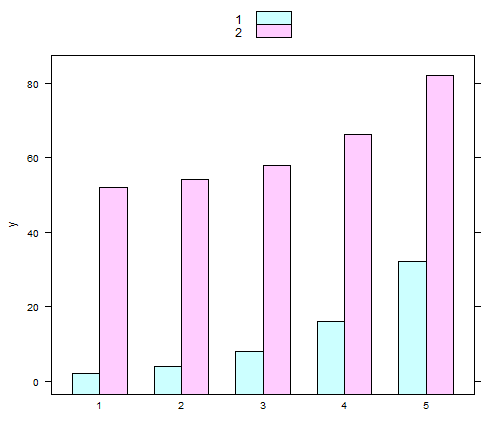 

--- &twocol

## Lattice - barchart w/ auto.key

*** =left


```r
barchart(y ~ as.factor(x),
  aggregate(y ~ x + g, data = d3, mean),
  groups = as.factor(g),
  auto.key = list(columns = 2))
```

*** =right

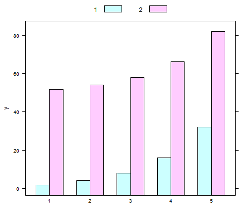 

--- &twocol

## Lattice - barchart w/ auto.key

*** =left


```r
barchart(y ~ as.factor(x),
  aggregate(y ~ x + g, data = d3, mean),
  groups = as.factor(g),
  auto.key = list(space = "right"))
```

*** =right

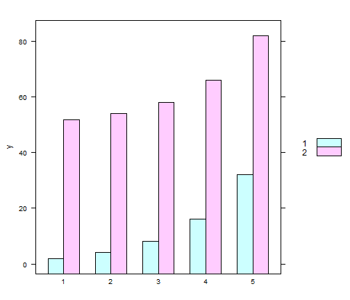 

--- &twocol

## Lattice - xyplot

*** =left


```r
xyplot(y~x,d1)
```

*** =right

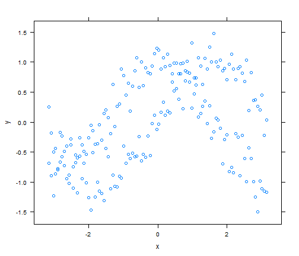 

--- &twocol

## Lattice - xyplot w/ conditioning factor

*** =left


```r
xyplot(y~x|type,d1)
```

*** =right

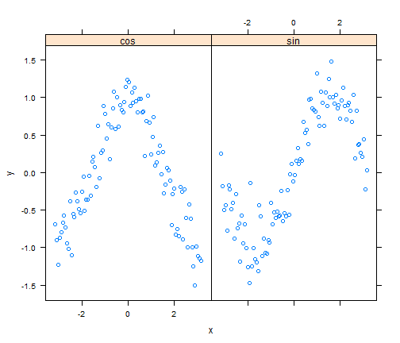 

--- &twocol

## Lattice - xyplot w/ grouping factor

*** =left


```r
xyplot(y ~ x, d1, groups = type,
  auto.key = list(space = "right"))
```

*** =right

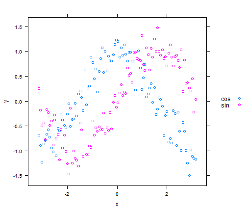 

--- &twocol

## Lattice - xyplot w/ two y variables

*** =left


```r
xyplot(y.cos + y.sin ~ x, d2,
  auto.key = list(space = "right"))
```

*** =right

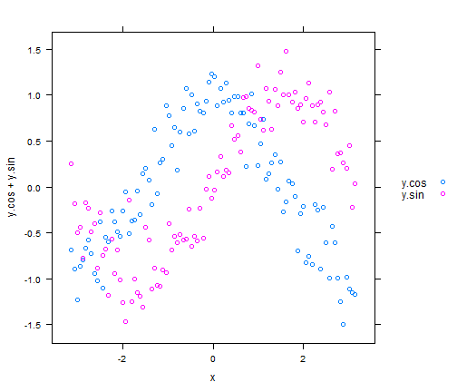 

--- &twocol

## Lattice - xyplot - changing plot type

*** =left


```r
xyplot(y ~ x, d1, groups = type,
  auto.key = list(space = "right"),
  type = "l")
```

*** =right

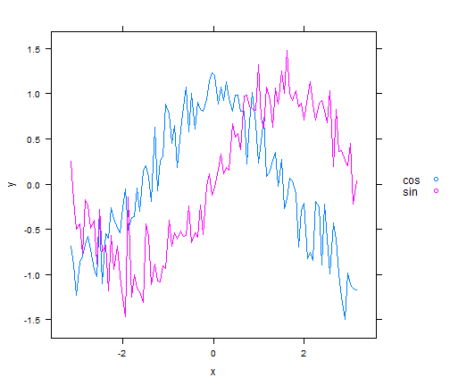 

--- &twocol

## Lattice - xyplot - changing plot type

*** =left


```r
xyplot(y ~ x, d1, groups = type,
  auto.key = list(space = "right"),
  type = "b")
```

*** =right

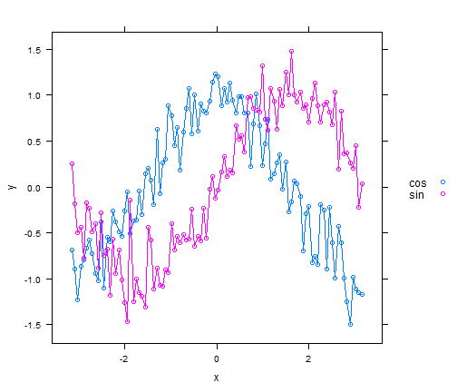 

--- &twocol

## Lattice - xyplot - opther options

*** =left


```r
xyplot(y ~ x, d1, groups = type,
  auto.key = list(space = "right"),
  type = "b", pch=2, cex=.5, lty=2, lwd=2)
```

*** =right

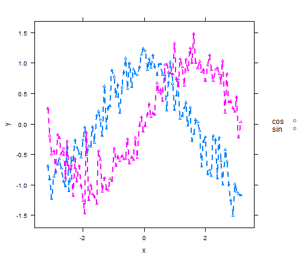 

--- &twocol

## Lattice - xyplot - tick locations

*** =left


```r
xyplot(y ~ x, d1, groups = type,
  auto.key = list(space = "right"),
  scales = list(x = list(
    at = c(-pi, -pi/2, 0, pi/2, pi))))
```

*** =right

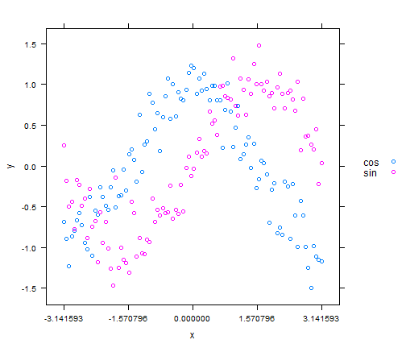 

--- &twocol

## Lattice - xyplot - tick labels

*** =left


```r
l <- expression(-pi, -pi/2, 0, pi/2, pi)
xyplot(y ~ x, d1, groups = type,
  auto.key = list(space = "right"),
  scales = list(x = list(
    at = c(-pi, -pi/2, 0, pi/2, pi),
    labels = l
    )))
```

*** =right

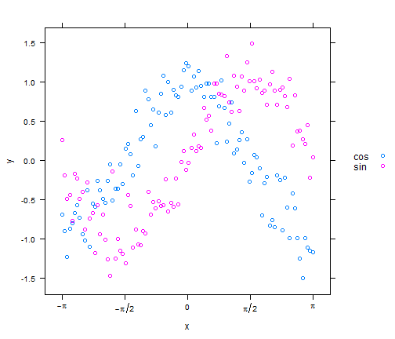 

--- &twocol

## Lattice Panels

*** =left


```r
xyplot(y ~ x, d1, groups = type,
  auto.key = list(space = "right"),
  type = "b",
  panel=function(...) {
    panel.xyplot(...)
  }
)
```

*** =right

 

--- &twocol

## Lattice Panels + Smoother

*** =left


```r
xyplot(y ~ x, d1, groups = type,
  auto.key = list(space = "right"),
  type = "p",
  panel = panel.superpose,
  panel.groups = function(..., pch, lwd) {
    panel.xyplot(..., pch = 2)
    panel.loess(..., span = .2, lwd = 4)
  }
)
```

*** =right

 

--- &twocol

## Lattice - levelplot

*** =left


```r
levelplot(z~x+y,d4)
```

*** =right

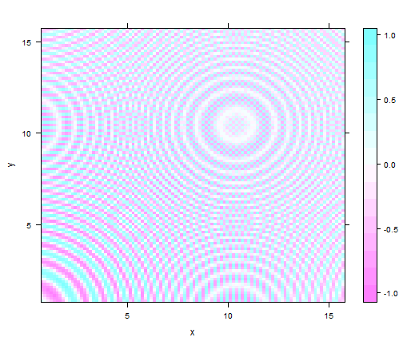 

---

## Lattice - need help?

### The arguments and valid values for all lattice plot functions are described in the help page for 'xyplot'.


```r
help(trellis)
```

---

## ggplot2

### Great documentation and examples available online

- http://docs.ggplot2.org/current
- http://www.ceb-institute.org/bbs/wp-content/uploads/2011/09/handout_ggplot2.pdf
- http://wiki.stdout.org/rcookbook/Graphs
